<div align="center">

# 🐋 ORCA DECK

### The Ultimate RFID-Based Password Manager & PC Controller
*Secure. Intuitive. Hardware-Backed.*

[](https://github.com/Muhib-Mehdi)
[](https://www.linkedin.com/in/muhib-mehdi-677bb7391/)
[](https://python.org)
[](https://arduino.cc)
[](LICENSE)

</div>

---

## 📑 Table of Contents
- [Overview](#-overview)
- [Why Choose ORCA DECK?](#-why-choose-orca-deck)
- [Key Features](#-key-features)
- [Hardware & Architecture](#-hardware--architecture)
- [Installation Or Setup](#-installation-or-setup)
- [Usage Guide](#-usage-guide)
- [Screenshots](#-screenshots)
- [Contributing](#-contributing)
- [License](#-license)

---

## 🌟 Overview

**ORCA DECK** is a high-security, hardware-integrated password manager and application launcher designed to bridge the gap between physical security and digital convenience. By leveraging **RFID technology**, it transforms a physical card into a secure key for your digital life, offering seamless authentication and workflow automation.

I built ORCA DECK to solve a common problem: **securely managing passwords without relying solely on software-based master passwords.** With ORCA DECK, your physical presence (verified via RFID) is the key.

---

## 🚀 Why Choose ORCA DECK?

| Feature | 🐋 ORCA DECK | 📱 Traditional Software Managers | 🔑 Physical Security Keys |
| :--- | :---: | :---: | :---: |
| **Physical 2FA** | ✅ Built-in RFID | ❌ No | ✅ Yes |
| **App Launcher** | ✅ One-tap Launch | ❌ No | ❌ No |
| **Offline Storage** | ✅ SPIFFS Encrypted | ⚠️ Cloud/Local DB | ❌ No Storage (usually) |
| **Custom Hardware** | ✅ DIY / Extensible | ❌ Software Only | ❌ Fixed Hardware |
| **Cost** | 💰 Affordable DIY | 💸 Monthly Subscriptions | 💵 Expensive |

---

## ✨ Key Features

### 🔒 Security & Authentication
- **RFID-Based Access**: The system remains locked until a registered RFID card is tapped.
- **Hardware Encryption**: Credentials are stored securely on the device's flash memory (SPIFFS).
- **Auto-Lock Timeout**: Automatically secures the deck after a configurable period of inactivity.
- **Emergency Recovery**: Secure Q&A fallback in case of lost cards.

### 🛠️ Productivity & Control
- **One-Tap App Launching**: Map specific RFID cards or menu buttons to launch desktop applications instantly.
- **Password Auto-Fill**: Select an account on the deck, and it types your password securely into your PC.
- **Cross-Platform PC Client**: A sleek Python (CustomTkinter) application to manage your keys and settings.

### 💾 Advanced Storage
- **SPIFFS Architecture**: Uses the ESP32's raw flash storage for high-speed, reliable data retention—no SD cards required.
- **Zero-Latency**: Instant read/write operations for a snappy user experience.

---

## 🏗 Hardware & Architecture

ORCA DECK operates on a Master-Slave architecture where the **Hardware Deck** handles security and inputs, while the **PC Client** executes commands.

```mermaid
graph TD
    subgraph Hardware_Deck ["🖥️ Hardware Deck (ESP32)"]
        A[RFID Reader RC522] -->|SPI| B(ESP32 MCU)
        C[TFT Display] <-->|SPI| B
        D[Matrix Keypad] -->|GPIO| B
        B <-->|SPIFFS| E[(Flash Storage)]
    end

    subgraph PC_System ["💻 PC System (Windows)"]
        B <-->|Serial / USB| F[Python Backend]
        F <--> G[CustomTkinter UI]
        F --> H{System Actions}
        H -->|Type Password| I[Keyboard Emulation]
        H -->|Run App| J[Process Launcher]
    end
```



---

## ⚙ Installation Or Setup

### Prerequisites

| Component | Requirement | Notes |
| :--- | :--- | :--- |
| **OS** | Windows 10/11 | Linux/Mac support coming soon |
| **Python** | v3.8+ | Ensure added to PATH |
| **Hardware** | ESP32 + RC522 | See wiring guide below |
| **Drivers** | CP210x Drivers | For ESP32 Serial comms |

### High-Level Setup Steps

<details>
<summary><b>1. Hardware Assembly</b> (Click to Expand)</summary>

1. Connect the **RC522 RFID Module** to the ESP32 (SPI Pins: SDA-21, SCK-18, MOSI-23, MISO-19).
2. Connect the **TFT Display** and **Keypad** according to the schema in `docs/wiring.md`.
3. Flash the firmware located in `firmware/orca_deck_ino` using Arduino IDE.

</details>

<details>
<summary><b>2. Software Installation</b> (Click to Expand)</summary>

1. **Clone the Repo:**
   ```bash
   git clone https://github.com/Muhib-Mehdi/orca-deck.git
   cd orca-deck
   ```

2. **Install Dependencies:**
   ```bash
   pip install -r requirements.txt
   ```

3. **Configure Settings:**
   - Open `assets/config.json`.
   - Set your correct `COM_PORT` (check Device Manager).

4. **Run the App:**
   ```bash
   python PC_client/orca_deck_app.py
   ```

</details>

---

## 🎮 Usage Guide

### 1. First-Time Setup
- Launch the PC Client.
- You will be asked to set **Security Questions**. **Do not forget these!** They are your only way back if you lose your Master RFID card.

### 2. Registering Cards
- Go to the **Settings** tab.
- Click **"Add New Card"**.
- Tap your RFID card on the hardware deck.
- Assign a function (e.g., "Unlock PC", "Launch Spotify", "Type Gmail Password").

### 3. Daily Workflow
1. **Unlock**: Tap your Master Card to unlock the deck.
2. **Select**: Use the touch screen or keypad to scroll through your saved credentials.
3. **Execute**: Press "Enter" to auto-type the password or launch the app on your PC.

> [!NOTE]
> Ensure your cursor is in the correct password field before triggering the "Type Password" command!

---

## 📸 Screenshots

### 🖥️ The Hardware
*Custom-built PCB with ESP32, TFT Display, and RFID Reader.*


### 📟 The Interface
*Clean, futuristic menu running on the embedded display.*


---

## 🤝 Contributing

I welcome contributions from the community! Whether it's adding new features, fixing bugs, or improving documentation, your help is appreciated.

1. **Fork** the repository.
2. Create a new branch: `git checkout -b feature/AmazingFeature`
3. Commit your changes: `git commit -m 'Add some AmazingFeature'`
4. Push to the branch: `git push origin feature/AmazingFeature`
5. Open a **Pull Request**.

---

<div align="center">

## 📄 License

Distributed under the **MIT License**. See `LICENSE` for more information.

---

### Developed with ❤️ by **Muhib Mehdi**
[GitHub Profile](https://github.com/Muhib-Mehdi) • [LinkedIn](https://www.linkedin.com/in/muhib-mehdi-677bb7391/)

</div>
